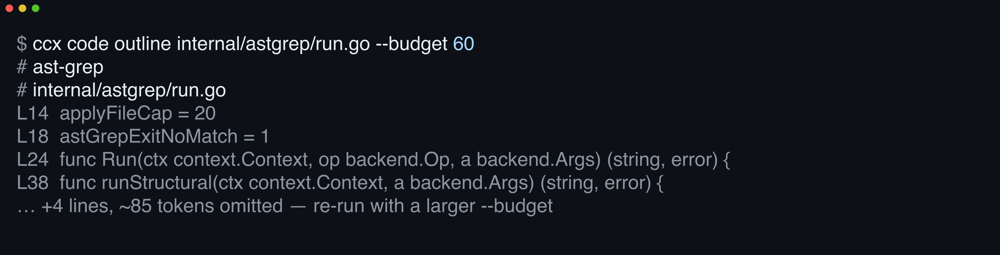

# 

**Take `cat` away from your agent.** Guard hooks block cat, raw grep, and full-file reads and rewrite each into a token-budgeted ccx call for an outline, a symbol with its callers, or a diff.

[](https://github.com/yasyf/cc-context/actions/workflows/ci.yml)
[](https://github.com/yasyf/cc-context/releases)
[](LICENSE)

## Get started

```
/plugin marketplace add yasyf/cc-skills
/plugin install cc-context@skills
```



The plugin arrives wired together: the `ccx` binary self-provisions (brew-first: a Homebrew-installed `ccx` when present, a checksum-verified release download into `${CLAUDE_PLUGIN_DATA}` otherwise), the MCP server auto-registers its `mcp__cc-context__ccx_*` tools plus `BashToon`, the guard hooks turn on, and the `ccx` skill teaches the reach-for-`ccx`-first workflow. It needs [`uv`](https://docs.astral.sh/uv/) on `PATH` — the hooks run through `uvx capt-hook`, and semantic search shells out to [semble](https://github.com/MinishLab/semble) via `uvx`.

Driving with an agent? Paste this:

```
/plugin marketplace add yasyf/cc-skills
/plugin install cc-context@skills
```

<details>
<summary>Using ccx outside Claude Code? Install the standalone CLI</summary>

The Homebrew formula pulls in ast-grep and uv:

```bash
brew install yasyf/tap/ccx
```

Without the plugin, register the MCP server by hand:

```bash
claude mcp add --scope user --transport stdio cc-context -- ccx mcp
```

</details>

---

## Use cases

### Orient in an unfamiliar repo in one command

Cold-starting in a codebase you've never seen burns the first few thousand tokens on `ls` and `cat` wandering. One command replaces the tour:

```bash
ccx repo overview
```

```console
[tilth] Go project — 75 source files, 10 directories
  dirs: cli/ backend/ astgrep/ vcs/ render/ toon/ outline/ mcpserver/ querykind/ locate/
  deps: asm, cobra, encoding, go-sdk, jsonschema-go, mousetrap, oauth2, pflag, sys, toon-go
  hot (× = importers): bench/ccxbench/types.py ×7, bench/ccxbench/config.py ×4, plugin/hooks/common.py ×4
  git: branch main, clean
  manifest: go.mod (github.com/yasyf/cc-context)
```

Structure, dependencies, the hottest files by importer count, and VCS state — a few hundred tokens instead of a directory crawl.

### Pull one symbol with its callers, not the whole file

Understanding one function shouldn't cost a whole-file read plus a grep for its call sites. Ask for the symbol:

```bash
ccx code symbol NewRootCmd
```

```console
# grok: NewRootCmd [internal/cli/root.go:11]

## signature
func NewRootCmd() *cobra.Command

## doc
// NewRootCmd builds the root command and registers its subcommands.

## body
…

## callees (4 internal, 5 extern)
…

## callers (5 of 6)
  internal/cli/cli_test.go
    [30]   in TestRootHelpListsAllOps()
…
```

Definition, doc, body, callees, and callers in one budgeted response — the agent edits code it never paged through.

### Cut gh and kubectl JSON output by 40–60%

`gh --json` and `kubectl -o json` dump verbose, nested JSON that floods the context window. Run the command through `ccx toon` and its JSON or NDJSON stdout comes back as TOON, a compact tabular encoding (or compact JSON when that is smaller):

```bash
ccx toon -- gh release list --limit 3 --json tagName,publishedAt,isLatest
```

```console
[3]{isLatest,publishedAt,tagName}:
  true,"2026-06-26T01:05:28Z",v0.2.1
  false,"2026-06-23T07:52:46Z",v0.2.0
  false,"2026-06-21T09:21:47Z",v0.1.1
```

That's less than half the bytes of the raw JSON, and typically 40–60% fewer tokens on tabular data. Non-JSON output passes through verbatim, stderr streams live, the exit code is propagated, and it doubles as a pipe filter (`… | ccx toon`). The MCP `BashToon` tool is the same wrapper in tool form.

## Compose tools without their output entering context

Every command above bounds or compresses the output of a single call. `ccx exec` goes one tier further: it runs a short Python script in a sandbox whose async host functions are every ccx query op, a gated `sh(cmd)`, and the tools of every stateless MCP server registered with Claude Code (auto-reflected — no flag needed). The script fans out calls, filters in the sandbox, and returns one value; only that value enters context, rendered as TOON or compact JSON and capped at `--budget`. Context cost is decoupled from work volume — a script can touch megabytes across dozens of calls and come back with a six-line answer:

```bash
ccx exec '
import asyncio
import re
async def main():
    raw = await outline("internal/cli")
    cmds = sorted(set(re.findall(r"func (new\w+Cmd)", raw)))
    return {"subcommands": len(cmds), "constructors": cmds}
asyncio.run(main())
'
```

```console
constructors[22]: newCodeCmd,newDepsCmd,newDiffCmd,newExecCmd,newFindCmd,newGrepCmd,newHelloCmd,newHistoryCmd,newLocateCmd,newMCPCmd,newOutlineCmd,newOverviewCmd,newReadCmd,newRelatedCmd,newReplaceCmd,newRepoCmd,newSearchCmd,newShipCmd,newShowCmd,newSymbolCmd,newToonCmd,newVcsCmd
subcommands: 22
```

The ~11,000-character outline of 38 files stayed in the sandbox; only the answer came back. In the spike's four replayed agent episodes, that pattern cut the characters entering context by 12–99× (a spike-measured character delta, not a result from the [benchmark harness](bench/README.md)).

Scripts use a restricted Python subset: no classes or `match`, one module per `import` line, only `re`/`json`/`datetime`/`asyncio`, and no top-level `return` — wrap logic in `async def main()` and end with `asyncio.run(main())`. `ccx exec --list-tools` prints the host-function catalog and the full rules; scripts arrive as an argument, `--file`, or stdin. The MCP facade exposes the same surface as `ccx_exec`, with `ccx_exec_tools` for the catalog. Reflected MCP servers run as fresh instances — if one needs live session state, exclude it with `CCX_EXEC_MCP_DENY`.

`ccx exec` is unavailable on Intel Macs (darwin/amd64 — the embedded Python runtime ships no library there); every other command works.

## The guard pack enforces it

A budgeted command only helps if the agent reaches for it. The bundled [capt-hook](https://github.com/yasyf/captain-hook) guard pack makes that the path of least resistance: its `PreToolUse`/`PostToolUse` hooks block the token-heavy primitives — `cat`, raw `grep`, an unbounded full-file `Read`, a `git diff` through a pager — and point the agent at the `ccx` equivalent instead. Reach for the raw tool and the hook turns you back; reach for `ccx` and you stay inside the budget by default.

The pack also watches for JSON. A command flagged for JSON output (`--json`, `-o json`) gets rewritten to run through `ccx toon`, and the pack learns which commands emit JSON so it can nudge you to wrap them next time.

## Commands

Each command is a token-bounded stand-in for a primitive an agent would otherwise reach for. Structural output is capped at `--budget` tokens, cut on a line boundary, with an explicit marker saying how much was dropped:

| Command | What it does |
| --- | --- |
| `ccx repo overview` | Repository structure and entry points; start here |
| `ccx code search <query> [path]` | Search routed by query kind: natural language runs semantic, an ast-grep pattern (`$A`, `$$$`) runs structural |
| `ccx code replace <pattern> <rewrite> [paths...]` | Structural find-replace; previews a diff, writes only with `--apply` |
| `ccx code related <file:line>` | Code semantically related to a location |
| `ccx code symbol <name>` (alias `grok`) | Definition, doc, body, callers, callees, siblings, tests |
| `ccx code outline <file-or-dir>` | Token-budgeted structural outline of a file or directory |
| `ccx code read <file> --section A-B` | Read a line range, a `## Heading`, or the whole file with `--full` |
| `ccx code deps <file>` | Symbols a file uses, and what uses it back |
| `ccx code grep <text> --glob G` | Literal text search, optionally globbed and budgeted |
| `ccx repo find <glob>` | List files matching a glob, with per-file token counts |
| `ccx repo locate <name>` | Resolve a sibling repo, Go module, or Python package to its on-disk path; exits 3 when unresolved |
| `ccx vcs diff [uncommitted\|staged\|<ref>]` | VCS-aware structural diff; defaults to uncommitted |
| `ccx vcs show [ref]` | Commit message plus a structural per-file diff of one commit; defaults to the last commit |
| `ccx vcs history <path> [-n N]` | Per-commit summary of a file's changed symbols; replaces `git log -p` |
| `ccx vcs ship [-m <msg>]` | Commit, push, and watch CI in one call: jj-aware commit, push, `gh run watch --exit-status` |
| `ccx toon [-- <cmd>]` | Re-encode a command's JSON/NDJSON output as TOON, or filter a pipe |
| `ccx exec [script]` | Run a sandboxed Python script composing ccx ops, `sh()`, and reflected MCP tools; only its return value enters context |

Run `ccx <command> --help` for the full flag set, and `ccx --version` for the build version. Three engines sit behind the one surface — semble for semantic search, ast-grep for structural search and rewrites, tilth for the rest — and `ccx` routes each command for you; `ccx exec` composes all of them from an embedded Python sandbox.

## Configuration

`ccx` reads no config file; behavior is tuned through environment variables:

| Variable | Effect |
| --- | --- |
| `LOG_LEVEL` | `debug`, `info` (default), `warn`, or `error`; logs go to stderr |
| `LOG_FORMAT` | set to `json` for structured logs |
| `CLAUDE_PLUGIN_DATA` | home of downloaded binaries (`ccx`, tilth, ast-grep), durable across plugin updates; the plugin's `bin/` holds only symlinks |
| `CCX_EXEC_MCP` | set to `off` to disable MCP auto-reflection in `ccx exec` |
| `CCX_EXEC_MCP_DENY` | comma-separated MCP server names `ccx exec` must never reflect (overrides the classifier) |
| `CCX_EXEC_MCP_ALLOW` | comma-separated MCP server names to reflect even when classified stateful |

Licensed under [PolyForm Noncommercial 1.0.0](LICENSE).
